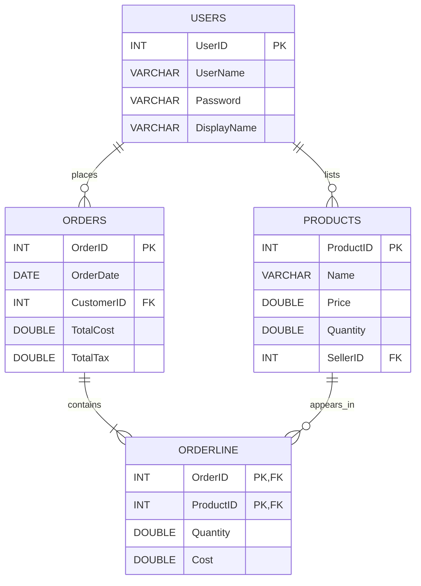

# Store App ER Diagram

## Relationship notes
- `USERS(UserID)` to `ORDERS(CustomerID)`: one user can create many orders.
- `USERS(UserID)` to `PRODUCTS(SellerID)`: one user can create/manage many products.
- `ORDERS(OrderID)` to `ORDERLINE(OrderID)`: one order has one or more order lines.
- `PRODUCTS(ProductID)` to `ORDERLINE(ProductID)`: one product can appear in many order lines.
- `ORDERLINE` uses composite key `(OrderID, ProductID)`.
