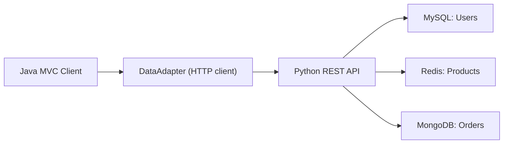

# Homework 2: Multi-Database Architecture & RESTful Data Access Layer

## Architecture



The Java Swing application from Homework 1 is preserved. The main change is in [DataAdapter.java](/Users/rahulgonsalves/Documents/School/CSCE310/storeapp/src/DataAdapter.java), which now sends HTTP requests to the backend service instead of executing SQL directly.

## Database Design

### MySQL: User Data

MySQL stores structured user records because user authentication and profile data are relational, stable, and easy to validate with a fixed schema.

Suggested table:

```sql
Users(
  UserID INT PRIMARY KEY,
  UserName VARCHAR(30) UNIQUE NOT NULL,
  Password VARCHAR(30) NOT NULL,
  DisplayName VARCHAR(30)
)
```

### Redis: Product Data

Redis stores products as hashes for fast key-based access and updates.

Key structure:

- `product:1`
- `product:2`

Example Redis hash:

```text
product:1
  ProductID = 1
  ProductName = Apple
  Price = 0.99
  Quantity = 100.0
  SellerID = 1
```

Redis is a good fit because product lookup and updates are frequent and naturally keyed by product ID.

### MongoDB: Order Data

MongoDB stores each order as a document because orders contain a variable-size list of line items.

Example document:

```json
{
  "OrderID": 1,
  "UserID": 1,
  "OrderDate": "2026-04-04",
  "TotalCost": 9.9,
  "TotalTax": 0.99,
  "Details": [
    { "ProductID": 321, "Quantity": 10.0, "Cost": 9.9 }
  ]
}
```

MongoDB is a good fit because order details are naturally hierarchical and can be stored as one document.

## REST API Endpoints

### Required endpoints

- `GET /users/{id}`: Retrieve a user from MySQL.
- `GET /products/{id}`: Retrieve a product from Redis.
- `POST /products/{id}`: Create or update a product in Redis.
- `GET /orders/{id}`: Retrieve an order from MongoDB.
- `POST /orders/{id}`: Create or update an order in MongoDB.
- `GET /orders/user/{userId}`: Retrieve all orders for one user from MongoDB.

### Helper endpoints used by the Java client

- `POST /users/login`: Validate username and password for the login screen.
- `GET /orders/next-id`: Generate the next integer order ID for the existing Homework 1 UI flow.

## Data Consistency

- Orders store `ProductID` and `UserID`, so references stay consistent across Redis, MongoDB, and MySQL.
- Before placing an order, the Java client loads product information from Redis and checks inventory.
- After a purchase, the Java client updates the product quantity through the product API and then stores the order through the order API.

## Full Workflow

1. User logs in from the Java client.
2. `LoginController` calls `DataAdapter.loadUser(...)`.
3. `DataAdapter` sends `POST /users/login`.
4. The Python backend validates the user in MySQL and returns JSON.
5. While building an order, the Java client requests each product with `GET /products/{id}` from Redis.
6. When the order is submitted, the client updates inventory with `POST /products/{id}`.
7. The client stores the order document with `POST /orders/{id}` in MongoDB.

## Files Added or Changed

- [backend_api.py](/Users/rahulgonsalves/Documents/School/CSCE310/storeapp/backend_api.py): REST API server for MySQL, Redis, and MongoDB.
- [migrate_homework1_data.py](/Users/rahulgonsalves/Documents/School/CSCE310/storeapp/migrate_homework1_data.py): Copies Homework 1 products and orders into Redis and MongoDB.
- [DataAdapter.java](/Users/rahulgonsalves/Documents/School/CSCE310/storeapp/src/DataAdapter.java): Java HTTP client replacing direct database access.
- [Application.java](/Users/rahulgonsalves/Documents/School/CSCE310/storeapp/src/Application.java): Startup updated to default to REST mode.
- [requirements.txt](/Users/rahulgonsalves/Documents/School/CSCE310/storeapp/requirements.txt): Python dependencies for the backend.

## Setup Instructions

### 1. Install Python packages

```bash
pip3 install -r requirements.txt
```

### 2. Start MySQL

Load your Homework 1 schema:

```bash
mysql -u root -p < mysql_storeapp.sql
```

### 3. Start Redis

Run a local Redis server, then load products through the API using `POST /products/{id}` or a short seed script.

### 4. Start MongoDB

Set `MONGODB_URI` to your MongoDB Atlas connection string or a local MongoDB URI.

Example:

```bash
export MONGODB_URI="mongodb+srv://<user>:<password>@<cluster>/<db>?retryWrites=true&w=majority"
```

### 5. Start the backend API

```bash
python3 backend_api.py
```

### 6. Migrate existing Homework 1 products and orders

```bash
python3 migrate_homework1_data.py
```

By default the migration script reads from `store.db`. To migrate from MySQL instead:

```bash
STOREAPP_MIGRATE_SOURCE=mysql python3 migrate_homework1_data.py
```

### 7. Compile and run the Java client

```bash
javac -cp "lib/*" -d bin src/*.java
STOREAPP_DATA_MODE=rest java -cp "bin:lib/*" Application
```

## Suggested Demo / Test Cases

- Login with `admin / password`.
- Load an existing product from Redis in the Product screen.
- Update a product price or quantity and confirm the Redis hash changed.
- Add items to an order and finish payment.
- Confirm the order document appears in MongoDB.
- Fetch the same order through `GET /orders/{id}`.
- Fetch all orders for the user through `GET /orders/user/{userId}`.
